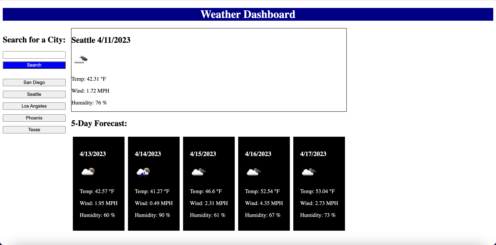

# Weather-Dashboard

## Description

This project allows the user to view the 5-day forecast for any city that is contained within OpenWeather API.

## Usage

Click the following link to visit the website: https://amman98.github.io/Weather-Dashboard/. Type any city name in the search bar and click Search to view the 5-day forecast. You can type more city names in the search bar and they will be added to your search history below to search button, where you can click to view them again.

Used following resource to figure out how to get element clicked on in a form: https://stackoverflow.com/questions/15495820/identify-the-value-of-clicked-submit-button-with-multiple-submit-buttons

Used following resource to figure out how to round a number to 2 decimal places: https://stackoverflow.com/questions/11832914/how-to-round-to-at-most-2-decimal-places-if-necessary

## License

Please refer to the LICENSE in the repo
